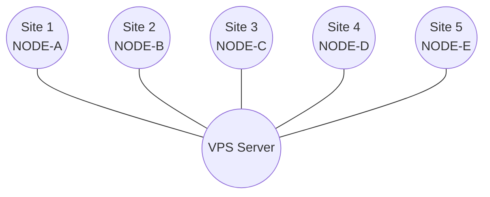

# Smart Traffic Management Network

## Problem Statement

A city operates several smart traffic controllers deployed at different road junctions. These controllers continuously exchange traffic information such as congestion levels, signal timings, and accident alerts. The communication network may consist of multiple disconnected regions of the city, meaning that some controllers may not be able to communicate with controllers in another region.

Before a city-wide status report can be generated, each communication region must determine whether it contains a controller that can directly or indirectly reach every other controller within that region. If multiple such controllers exist in the same region, any one of them may be selected randomly. The selected controller should coordinate the collection of a consistent global state of its region while normal traffic updates continue to be exchanged.

The implementation should use a directed communication graph with at least five participating sites.


## Architecture

This project implements a distributed traffic controller simulation with **Chandy-Lamport** snapshot capabilities. It uses standard Java sockets and multithreading.

**Detailed Architecture Model:** 
1. **Server (Global Coordinator)**: A central VPS/Server that provides a CLI. It allows us to view the global state of all nodes and can trigger a global snapshot by sending a message to all connected Sites.
2. **Sites / Nodes (Clients)**: We have `m` Sites. Each Site acts as a client connected to the Server and represents an entire geographic node.
3. **Traffic Outposts (Threads)**: Inside each Site, we spawn `n` traffic outpost controllers as separate threads. These threads form a directed communication graph *within* that Site and continuously exchange traffic updates with each other.
4. **Snapshot Execution (Chandy-Lamport / Diffusion)**: 
   - When the Server triggers a snapshot, it sends a command to the Sites.
   - Within each Site, we first evaluate the directed graph of the `n` threads to find a valid "initiator" (a thread that can directly or indirectly reach all other threads in the region). 
   - We randomly select one of these valid initiators to coordinate the Chandy-Lamport snapshot across the threads in that Site.
5. **Reporting**: Once a Site's threads finish the Chandy-Lamport snapshot, the Site aggregates this local state and sends it back to the Server, which then displays the state of all `m` sites in its CLI.

## Logical Topology Diagram

*(The VPS dynamically assigns logical neighbors and routes Chandy-Lamport markers across this star topology.)*

## How to Build and Run

### 0. Environment Setup
Before running the project, you need to set up the environment configuration files. Copy the example files to create your local configurations:
```bash
cp server.env.example server.env
cp node.env.example node1.env
# You will need to create node2.env through node5.env similarly, 
# ensuring that NODE_NAME and CONTROLLER_COUNT are correctly set for each node.
```

### 1. Build the project
**Linux/macOS:**
```bash
./scripts/build.sh
```

**Windows (PowerShell):**
```powershell
# Create the output directory if it doesn't exist
New-Item -ItemType Directory -Force -Path out | Out-Null

# Compile all Java files under src
javac -d out (Get-ChildItem -Recurse -Filter *.java src | ForEach-Object { $_.FullName })
```

### 2. Start the VPS Server
Open a new terminal and run:
```bash
./scripts/run_server.sh
```
OR 
```bash
java -cp out trafficsync.cli.ServerApp server.env

```

### 3. Start the Nodes
Open 5 new terminals, and in each run one of the following:

**Linux/macOS:**
```bash
./scripts/run_node.sh node1.env
./scripts/run_node.sh node2.env
./scripts/run_node.sh node3.env
./scripts/run_node.sh node4.env
./scripts/run_node.sh node5.env
```

**Windows (PowerShell):**
```powershell
java -cp out trafficsync.cli.NodeApp node1.env
java -cp out trafficsync.cli.NodeApp node2.env
java -cp out trafficsync.cli.NodeApp node3.env
java -cp out trafficsync.cli.NodeApp node4.env
java -cp out trafficsync.cli.NodeApp node5.env
```

### 4. Interactive Terminal UI
Each instance opens an interactive dashboard rendered with ANSI sequences. 
- Press `s + Enter` in a node terminal to initiate a Chandy-Lamport snapshot.
- Press `t + Enter` to manually fire a traffic message.
- Press `m <id/name> <msg> + Enter` to manually send a message to another node.
- Press `i <name> + Enter` to query a node's ID, or `i self` for self ID.
- Press `x + Enter` to gracefully exit the application.


## Demonstration Checklist
1. **Node Registration**: Start the VPS, then Node-1. Note the registration message in the VPS UI and the CONNECTED status in the Node UI.
2. **Message Exchange**: The local controller threads in nodes will automatically simulate traffic events every 5-15s. They send events through the VPS to a random neighbor.
3. **Chandy-Lamport**: In Node-1, type `s` and hit Enter. Node-1 records state and floods MARKER messages. Other nodes receive markers, record their states, and eventually send a SNAPSHOT_RESPONSE to the VPS.
