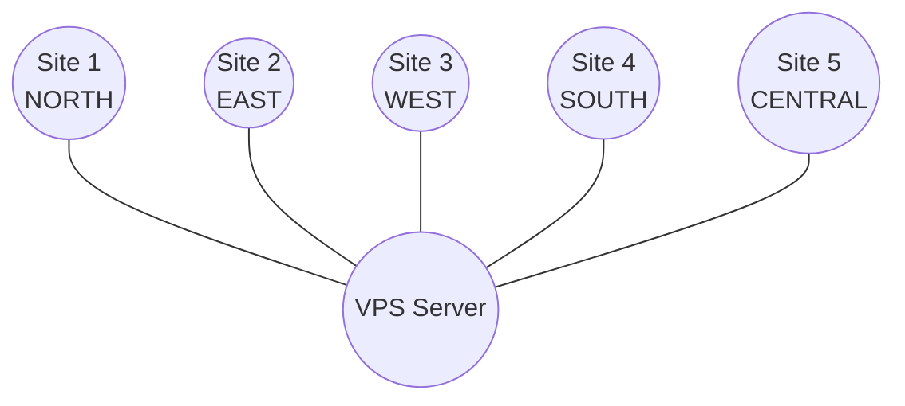

# Smart Traffic Management Network

## Architecture

This project implements a distributed traffic controller simulation with **Chandy-Lamport** snapshot capabilities. It uses standard Java sockets and multithreading.

**Terminology & Topology:** 
- **Site (Node / Region)**: An entire geographic region registers as a single node, which we call a **Site**.
- **Outposts**: Inside each Site, multiple traffic outposts (controllers) are simulated using Java threads.
- **Physical Transport**: Follows a **Star Topology** with the VPS Server at the center. Sites establish a single TCP connection to the VPS. 
- **Logical Directed Graph**: The VPS dynamically builds a logical directed graph across all connected Sites and relays messages (traffic updates and Chandy-Lamport markers) transparently between them.

## Logical Topology Diagram

*(The VPS dynamically assigns logical neighbors and routes Chandy-Lamport markers across this star topology.)*

## How to Build and Run

### 0. Environment Setup
Before running the project, you need to set up the environment configuration files. Copy the example files to create your local configurations:
```bash
cp server.env.example server.env
cp node.env.example node1.env
# You will need to create node2.env through node5.env similarly, 
# ensuring that NODE_ID, REGION_ID, and NEIGHBORS are correctly set for each node.
```

### 1. Build the project
```bash
./scripts/build.sh
```

### 2. Start the VPS Server
Open a new terminal and run:
```bash
./scripts/run_server.sh
```

### 3. Start the Nodes
Open 5 new terminals, and in each run one of the following:
```bash
./scripts/run_node.sh node1.env
./scripts/run_node.sh node2.env
./scripts/run_node.sh node3.env
./scripts/run_node.sh node4.env
./scripts/run_node.sh node5.env
```

### 4. Interactive Terminal UI
Each instance opens an interactive dashboard rendered with ANSI sequences. 
- Press `s + Enter` in a node terminal to initiate a Chandy-Lamport snapshot.
- Press `t + Enter` to manually fire a traffic message.
- Press `q + Enter` to quit the active task (e.g., snapshot waiting phase).
- Press `x + Enter` to gracefully exit the application.

### 5. VPS Server Inspector (curl)
Open a new terminal and inspect the global state via HTTP:
```bash
curl http://localhost:8080/ping
curl http://localhost:8080/nodes
curl http://localhost:8080/topology
curl http://localhost:8080/snapshot/status
```

## Demonstration Checklist
1. **Node Registration**: Start the VPS, then Node-1. Note the registration message in the VPS UI and the CONNECTED status in the Node UI.
2. **Message Exchange**: The local controller threads in nodes will automatically simulate traffic events every 5-15s. They send events through the VPS to a random neighbor.
3. **Chandy-Lamport**: In Node-1, type `s` and hit Enter. Node-1 records state and floods MARKER messages. Other nodes receive markers, record their states, and eventually send a SNAPSHOT_RESPONSE to the VPS. 
4. **Global Verification**: Run `curl http://localhost:8080/snapshot/status` to view the aggregated snapshot state from the server.
